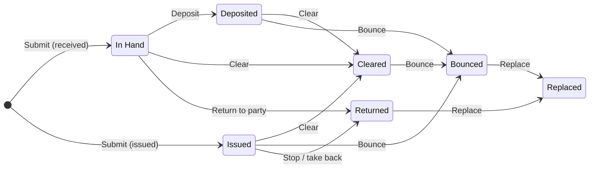

  
  <h1>PDC Management for ERPNext</h1>
  
Post-dated and current cheques, from receipt to clearance or bounce, with the accounting done right.

ERPNext records a cheque as a Payment Entry that is "paid" the day you type it in. That is wrong for a post-dated cheque: the money is not in the bank, the cheque can bounce, and nobody is reminded to deposit it on its date. PDC Management tracks every cheque you **receive** from customers and **issue** to suppliers through its real life (in hand, deposited, cleared, bounced, returned, replaced) and posts the correct journal entry at each step.

## Features

- **Received and issued cheques** against one or more Sales / Purchase Invoices, with any unallocated amount posted as an advance. Refund cheques against credit and debit notes work too.
- **Correct books at every step.** A cheque in hand sits in a *Cheques in Hand* asset account, not in the bank and not as an open receivable. Clearing moves it to the bank and sets the bank reconciliation clearance date.
- **Bounce handling** after deposit *or* after clearance. The invoice is reopened on the bounce date (nothing earlier is cancelled, so closed periods stay closed), bank charges can be booked to expense or recovered from the customer, and the reason is recorded.
- **Replace / re-present** a bounced or returned cheque in one click. The replacement settles what is still open, and the original is marked *Replaced*.
- **Undo last step** for mistakes (deposit, clearance, bounce, return), with the linked entry cancelled.
- **Guards.** No deposit or clearance before the cheque date, stale cheques blocked (configurable validity), duplicate cheque numbers blocked, steps cannot be back-dated before the previous one, invoices with an active cheque cannot be cancelled, and the cheque's journal entries cannot be cancelled behind its back.
- **Multi-currency.** Foreign-currency customers and suppliers, cleared into a company-currency or foreign-currency bank, with the exchange difference posted automatically.
- **Accounting dimensions and cost center** copied to every entry, including mandatory dimensions such as Branch.
- **Daily digest email** of cheques overdue for deposit, due this week, about to go stale, and issued cheques that may be presented.
- **Reports.** Cheque Register (with chart and summary), Cheque Maturity (ageing buckets by cheque or by party) and Cheque Bounce Analysis (bounce rate per customer, a credit-risk signal before you accept the next PDC).
- **Desk.** Workspace with number cards and charts, calendar view of cheque dates, a Cheque Acknowledgement print format, *Create → Cheque* on invoices, and cheques in the Customer and Supplier connections.

## Lifecycle

## What gets posted

| Step | Received cheque | Issued cheque |
| --- | --- | --- |
| Submit | Dr Cheques in Hand · Cr Customer (against invoices) | Dr Supplier (against invoices) · Cr Cheques Issued |
| Deposit | nothing; date and bank are recorded | n/a |
| Clear | Dr Bank · Cr Cheques in Hand | Dr Cheques Issued · Cr Bank |
| Bounce (before clearance) | Dr Customer (invoice reopened) · Cr Cheques in Hand | Dr Cheques Issued · Cr Supplier (bill reopened) |
| Bounce (after clearance) | Dr Customer · Cr Bank | Dr Bank · Cr Supplier |
| Bank charges on bounce | Dr Bounce Charges (or Customer) · Cr Bank | Dr Bounce Charges · Cr Bank |
| Return / stop | reverses the receipt on the return date | reverses the issue on the return date |

Every entry is a normal Journal Entry linked back to the cheque, so the General Ledger, Accounts Receivable / Payable, Bank Reconciliation and financial statements all stay correct. See [docs/accounting.md](docs/accounting.md) for the full design.

## Installation

Install **PDC Management** from the Frappe Cloud Marketplace, or see [docs/installation.md](docs/installation.md) for self-hosted benches. Works on Frappe / ERPNext v15 and v16.

## Documentation

| For Users | For Developers |
| --- | --- |
| **[User Guide](docs/user-guide.md)**: a step-by-step tutorial covering setup, receiving, depositing, clearing, bounces, replacements, issued cheques, fixing mistakes and reports. | **[Developer Guide](docs/developer-guide.md)**: local setup, code layout, how the posting works, extension hooks, REST usage, tests, CI and releases. |
| **[Accounting Design](docs/accounting.md)**: every entry the app posts and why. | **[Contributing](CONTRIBUTING.md)**: how to propose changes. |

## Setup (2 minutes)

1. Open **Cheque Settings**, click **Create Missing Accounts** and pick your company. It adds *Cheques in Hand* (asset), *Cheques Issued* (liability) and *Cheque Bounce Charges* (expense) to the chart of accounts and fills the row. You can select your own accounts instead; party-type (Receivable / Payable) accounts are rejected on purpose.
2. Optional: set the cheque validity (default 3 months), the digest role and look-ahead, and whether unallocated amounts are allowed.
3. Give users the **Accounts User** role to record and move cheques, and **Accounts Manager** to cancel or undo.

## Daily use

- From a submitted Sales or Purchase Invoice: **Create → Cheque**. Or open **Cheque → New**, choose the party and click **Get Outstanding Invoices**; the amount is allocated oldest-due first.
- On the submitted cheque, the **Actions** menu shows only what is possible next: Deposit, Clear, Bounce, Return, Replace, Undo Last Step.
- Watch the **Cheques** workspace and the daily digest for what to deposit today.

The [User Guide](docs/user-guide.md) walks through each of these with the exact clicks.

## FAQ

**Why not just use Payment Entry?** A Payment Entry says the money is in the bank. A post-dated cheque is a promise, and it may bounce. Keeping it in a holding account until it clears makes your bank balance and cash flow true.

**Does the customer's outstanding drop when I receive a PDC?** Yes. The invoice is settled by the cheque (that is what the customer did), and the cheque itself is visible as an asset. If it bounces, the invoice is reopened on the bounce date.

**Can I deposit a post-dated cheque early?** No. Banks do not accept it, so the app does not either.

**My period is closed. Will a bounce break it?** No. Bounce and return post a new entry on their own date; nothing in the closed period is cancelled.

**What about the exchange difference on a foreign-currency invoice?** Like any ERPNext journal entry against an invoice, the difference between the invoice rate and the cheque rate remains on the receivable until you run Exchange Rate Revaluation. A difference between the cheque rate and the clearing rate of a foreign-currency bank is posted to the company's Exchange Gain / Loss account on clearance.

## Contributing

Issues and pull requests are welcome. Start with the [Developer Guide](docs/developer-guide.md) and [CONTRIBUTING.md](CONTRIBUTING.md).

## License

MIT. See [license.txt](license.txt). [Privacy Policy](docs/privacy-policy.md) · [Terms of Use](docs/terms.md)
